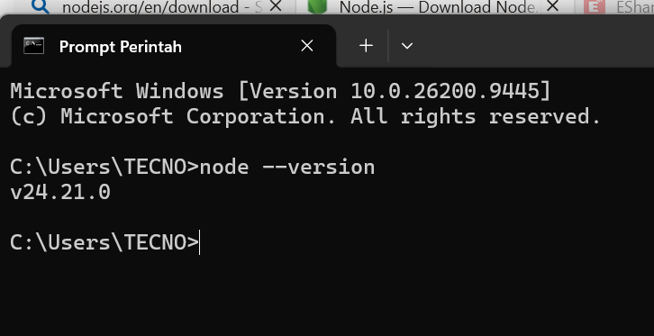
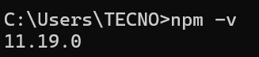
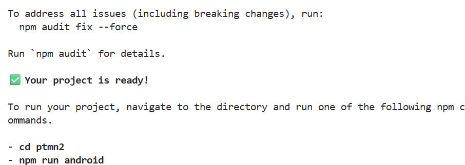
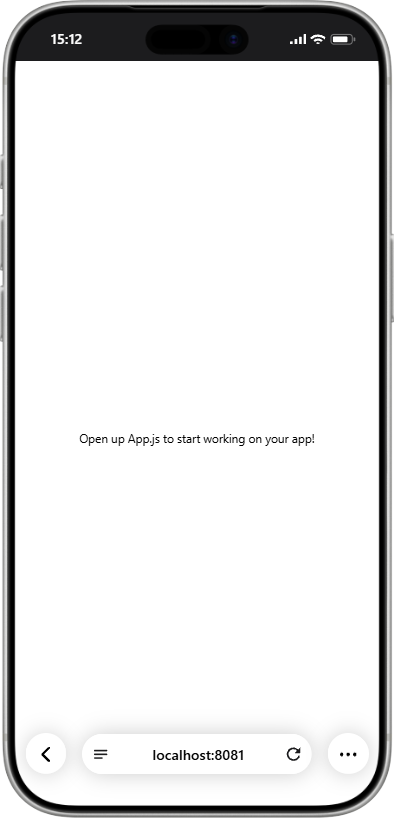
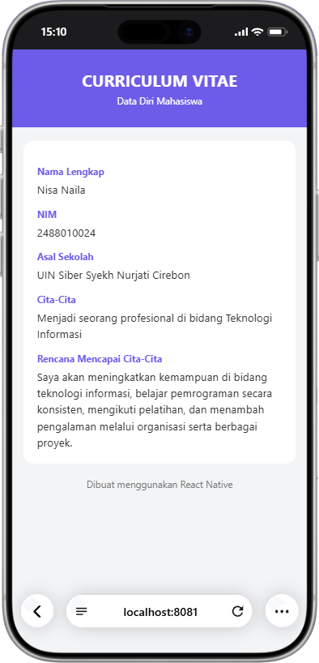

# Praktikum Menyiapkan dan Memulai pemrograman Mobile (React Native) #

### Tujuan Pembelajaran ##
Mahasiswa mampu:
1. Menyiapkan dan Memulai Pemrograman Mobilen (React Native)
2. Membuat Aplikasi Mobile (React Native)
3. Membuat CV sederhana dengan React Native 

### Materi Pembelajaran ###
1. Menyiapkan dan memulai Pemrograman Mobile (React Native)
- Install Interpreter Node.js
- download dan install node.js di alamat https://nodejs.org/en/download
- Konfirmasi versi node.js
- node -v

- Konfirmasi npm 
- npm -v

2. Membuat Aplikasi Mobile (React Native)
- Untuk Referensi Dokumentasi Resmi milik Expo 
- https://docs.expo.dev/
- Untuk Referensi Dokumetasi resmi milik React Native 
- https://reactnative.dev/
- Memulai membuat projek baru dengan Framework Expo Go

- npx create-expo-app ptmn2 --template blank

- 

3. Menjalankan Aplikasi Mobile 
- cd ptmn2
- npx expo start
- instal Expo go via playstore
-install Expo go via app store
- Buka dan Scan QR Code Via Expo Go
- Running via Web Browser Emulator
- ctrl+c untuk menghentikan server
- Sebelumnya install (npx expo install react-dom react-native-web)
- mpx expo start --web

4. Tugas Praktikum Pemrograman
- Menambahkan CV Sederhana dengan react native
- Nama Lengkap
- NIM
- Asal Sekola 
- cita cita
- Rencana mencapai cita cita

