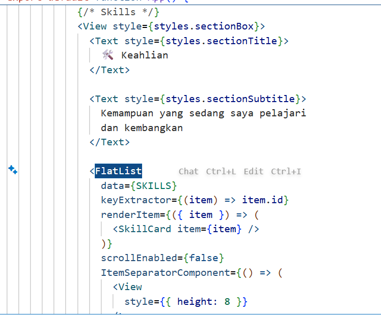
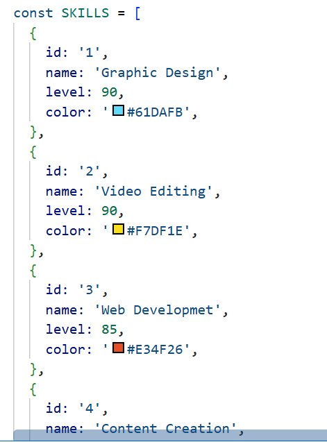
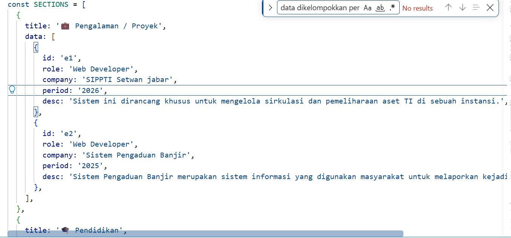
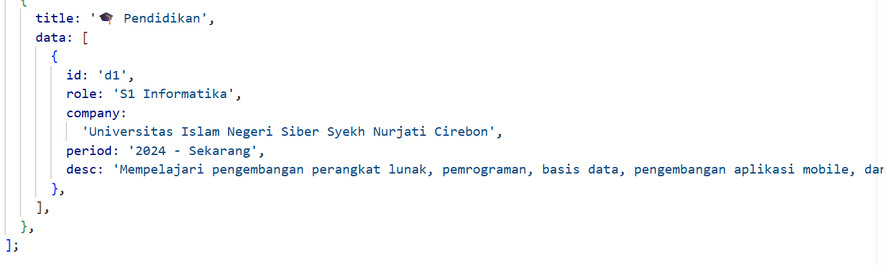
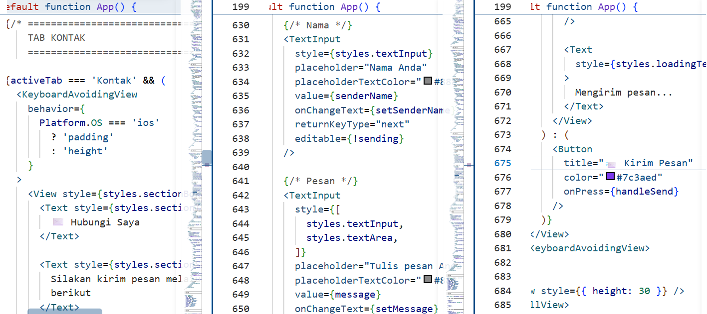
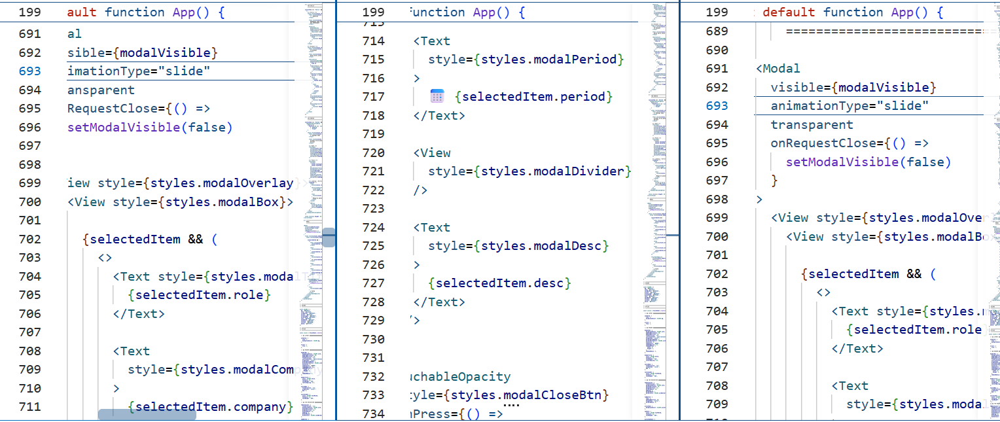
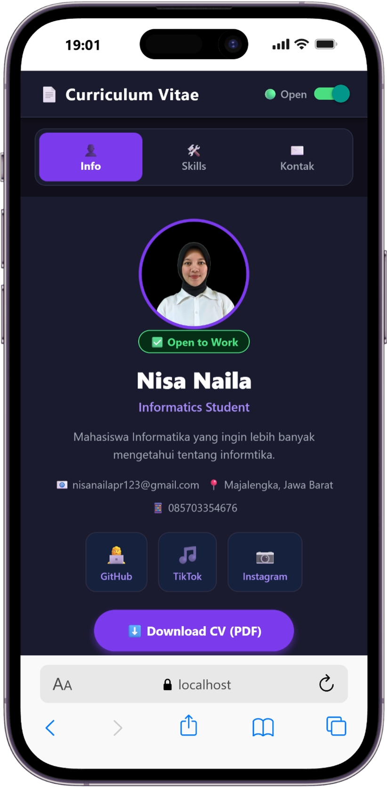
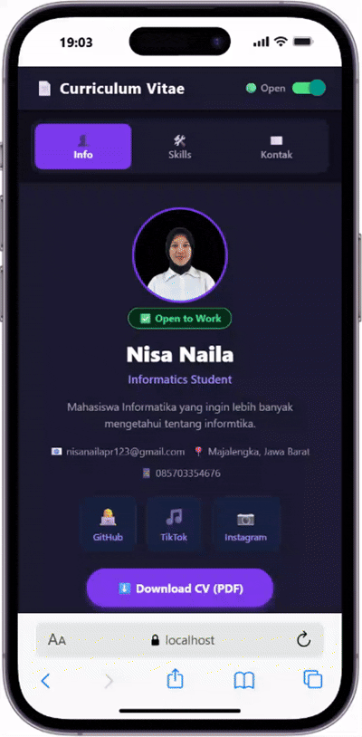

# 📱 Modul Praktikum 4: Core Components & Styling #

## 🎯 Tujuan Pembelajaran

Setelah menyelesaikan praktikum ini, mahasiswa mampu:

1. Memahami dan menggunakan **16 Core Components** React Native
2. Menerapkan **StyleSheet** untuk styling terpusat
3. Menggunakan **useState** untuk state management dasar
4. Membuat layout yang responsif dengan **Flexbox**
5. Menangani **interaksi pengguna** (tekan, input, scroll)

## 📲 Praktikum ##
### Langkah 1: Import Libarary & Components ###
1. Buka File App.js pada folder projek ptmn2
2. Import Library dan core component yang dibutuhkan
3. Konfirmasi bukti

### Langkah 2: Menyiapkan Array objek untuk menampung data ###
1. Membuat Array objek bernama PROFILE untuk menampung data Profile
2. Konfirmasi bukti

3. Membuat Array Objek bernama SKILLS untuk Menampung Data Profile
4. Konfirmasi Bukti

5. Membuat Array Objek bernama SECTION untuk menampung Data Profile
6. Konfirmasi Bukti

### Langkah 3 : Membuat Sub-Components ###
1. Membuat sub-component SkillCard dan TimelineCard untuk menampilkan data skill serta riwayat pengalaman/pendidikan
2. Konfirmasi Bukti

### Langkah 4 : State Management dengan useState ###
Menambahkan useState untuk menyimpan data yang dapat berubah pada aplikasi
State digunakan untuk mengatur kondisi seperti status Open to Work, form input, loading, dan modal
Setiap perubahan state akan menyebabkan komponen melakukan re-render
✅ Checkpoint: Aplikasi masih menampilkan teks, tidak ada error

.png>)

### angkah 6 : ScrollView & Profil Section ###
1. Menggunakan ScrollView untuk membuat seluruh isi CV dapat digulir
2. Menampilkan foto profil menggunakan komponen gambar
3. Menampilkan informasi profil seperti nama, jabatan, dan bio
4. Menambahkan tombol media sosial menggunakan komponen interaksi pengguna.
✅ Checkpoint: Foto profil, nama, jabatan, bio, dan tombol sosmed terlihat

.png>)

### Langkah 7 : FlatList — Daftar Skills ###
1. Menampilkan data skills menggunakan komponen FlatList
2. FlatList digunakan untuk menampilkan data dalam bentuk daftar secara lebih efisien
3. Data yang ditampilkan berasal dari array objek SKILLS
4. Setiap skill ditampilkan dalam bentuk card yang memiliki progress bar sesuai persentase kemampuan

✅ Checkpoint: Daftar skill dengan progress bar berwarna-warni terlihat

### Langkah 8 : SectionList — Pengalaman & Pendidikan ###
1. Menampilkan data pengalaman dan pendidikan menggunakan SectionList
2. Data dikelompokkan berdasarkan kategori atau section
3. Section digunakan untuk memisahkan bagian pengalaman kerja/organisasi dan riwayat pendidikan
4. Setiap data ditampilkan menggunakan TimelineCard

✅ Checkpoint: Daftar pengalaman kerja & pendidikan terkelompok terlihat

### Langkah 8 : SectionList — Pengalaman & Pendidikan ###
1. Menampilkan data pengalaman dan pendidikan menggunakan SectionList
2. Data dikelompokkan berdasarkan kategori atau section
3. Section digunakan untuk memisahkan bagian pengalaman kerja/organisasi dan riwayat pendidikan
4. Setiap data ditampilkan menggunakan TimelineCard

-- Pengalaman Kerja

-- Pendidikan

✅ Checkpoint: Daftar pengalaman kerja & pendidikan terkelompok terlihat

### Langkah 9 : TextInput, Button & ActivityIndicator ###
1. Membuat form kontak menggunakan TextInput untuk menerima input dari pengguna
2. Menggunakan Button sebagai tombol untuk mengirim pesan
3. Menggunakan ActivityIndicator sebagai indikator ketika proses pengiriman sedang berlangsung
4. Input nama dan pesan dikontrol menggunakan state
5. Setelah tombol kirim ditekan, aplikasi menampilkan proses loading kemudian memberikan notifikasi bahwa pesan berhasil dikirim

✅ Checkpoint: Form input nama & pesan berfungsi. Tekan "Kirim Pesan" → loading 2 detik → Alert sukses

### Langkah 10 : Modal — Popup Detail ###
1. Menambahkan komponen Modal untuk menampilkan detail riwayat
2. Modal ditampilkan ketika pengguna menekan kartu riwayat
3. Modal menggunakan animasi slide sehingga muncul dari bagian bawah layar
4. Menambahkan tombol Tutup untuk menutup modal

✅ Checkpoint: Ketuk kartu riwayat → modal muncul dari bawah → tombol Tutup menutup modal

### Langkah 11 : StyleSheet — Styling Terpusat ###
1. Membuat konstanta warna untuk mengatur palet warna aplikasi
2. Menggunakan StyleSheet.create() untuk mengatur seluruh tampilan aplikasi secara terpusat
3. Styling diterapkan pada bagian header, profil, sosial media, section, skill card, timeline card, form input, loading, dan modal
4. Penggunaan StyleSheet membuat kode styling lebih terorganisir dan mudah dikelola

### Langkah 12 : Verifikasi & Pengujian ###
1. Menjalankan aplikasi untuk memastikan seluruh komponen dan fitur dapat digunakan dengan baik
2. Melakukan pengujian terhadap tampilan profil, scrolling, switch, daftar skills, riwayat, form kontak, modal, dan tombol sosial media
3. Hasil pengujian disesuaikan dengan fungsi yang telah dibuat pada aplikasi

