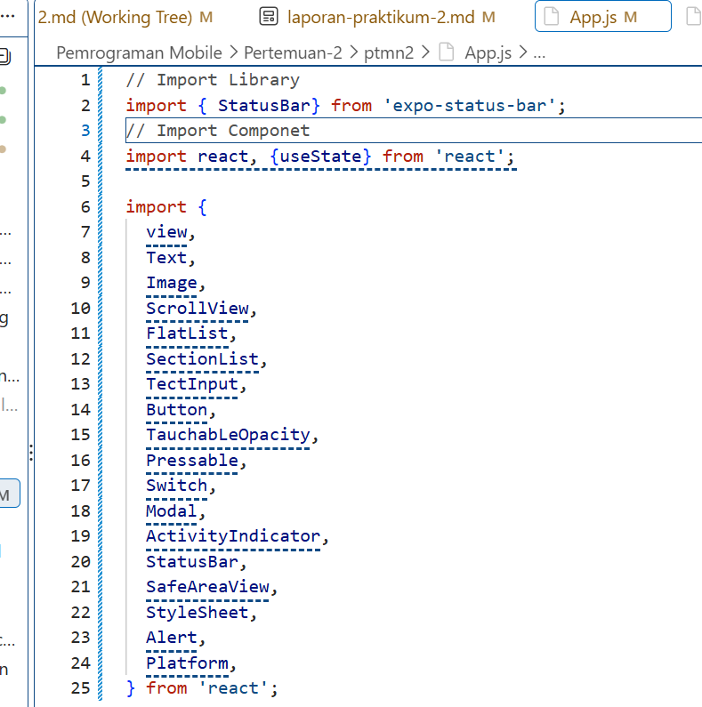
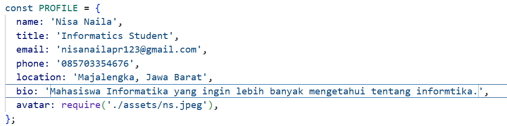
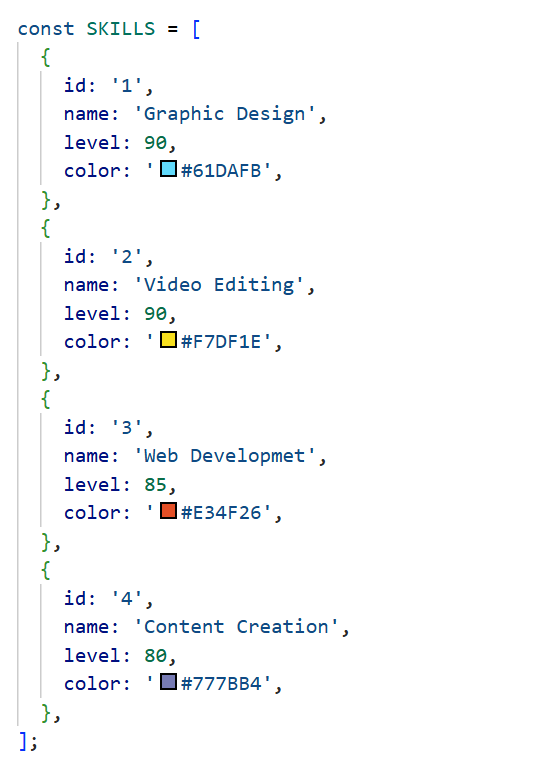
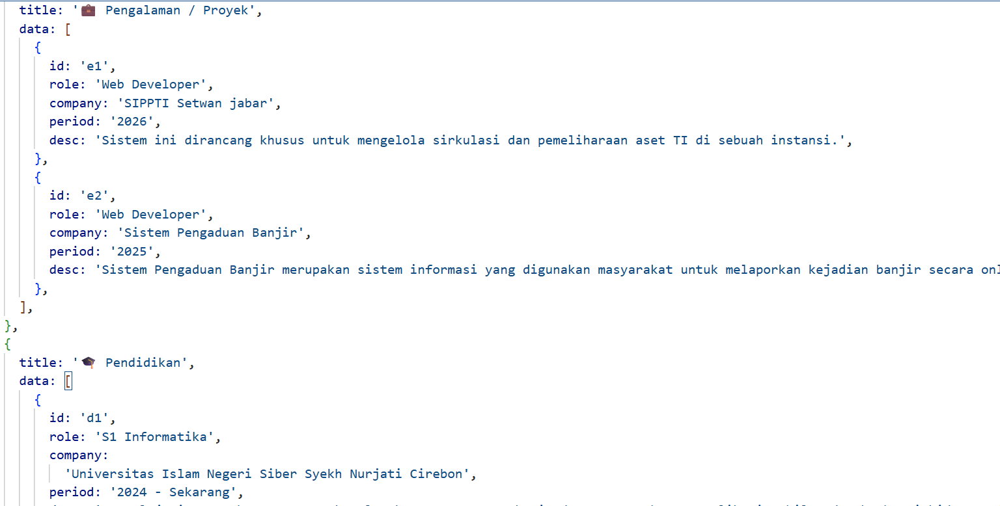
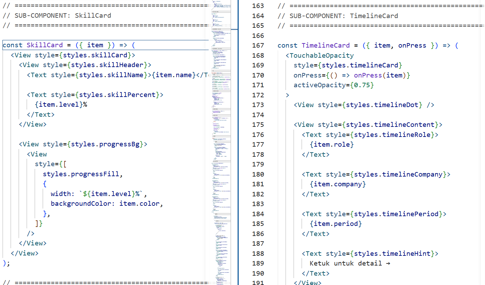

# 📱 Modul Praktikum 4: Core Components & Styling #

## 🎯 Tujuan Pembelajaran

Setelah menyelesaikan praktikum ini, mahasiswa mampu:

1. Memahami dan menggunakan **16 Core Components** React Native
2. Menerapkan **StyleSheet** untuk styling terpusat
3. Menggunakan **useState** untuk state management dasar
4. Membuat layout yang responsif dengan **Flexbox**
5. Menangani **interaksi pengguna** (tekan, input, scroll)

## 📲 Praktikum ##
### Langkah 1: Import Libarary & Components ###
1. Buka File App.js pada folder projek ptmn2
2. Import Library dan core component yang dibutuhkan
3. Konfirmasi bukti

### Langkah 2: Menyiapkan Array objek untuk menampung data ###
1. Membuat Array objek bernama PROFILE untuk menampung data Profile
2. Konfirmasi bukti

3. Membuat Array Objek bernama SKILLS untuk Menampung Data Profile
4. Konfirmasi Bukti

5. Membuat Array Objek bernama SECTION untuk menampung Data Profile
6. Konfirmasi Bukti

### Langkah 3 : Membuat Sub-Components ###
1. Membuat sub-component SkillCard dan TimelineCard untuk menampilkan data skill serta riwayat pengalaman/pendidikan
2. Konfirmasi Bukti

### Langkah 4 : State Management dengan useState ###
Menambahkan useState untuk menyimpan data yang dapat berubah pada aplikasi
State digunakan untuk mengatur kondisi seperti status Open to Work, form input, loading, dan modal
Setiap perubahan state akan menyebabkan komponen melakukan re-render
✅ Checkpoint: Aplikasi masih menampilkan teks, tidak ada error

### Lanjutkan sampai selesai ###